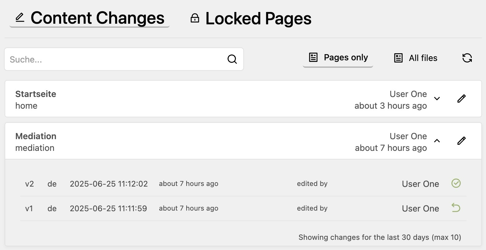

# Content Watch Plugin for Kirby

This plugin tracks all content changes in your Kirby site and adds a panel view that displays those changes.
It shows modification date and editor information and the history of changes for each file.
This allows you to keep track of what has been changed and who made the changes.

Additionally it provides a view to see which pages are currently locked and by whom.

[](https://github.com/tearoom1/kirby-content-watch)

## Features

- **Change Tracking**: Automatically tracks all content changes in pages and files
- **Editor Attribution**: Records which editor made each change with timestamp
- **History Timeline**: Lists all content files across your Kirby site, sorted by modification date
- **Locked Pages View**: Shows which pages are currently being edited and by whom
- **Search Functionality**: Quickly find specific content files
- **Direct Panel Links**: One-click access to edit content in the Panel
- **Customizable Retention**: Configure how long history is kept
- **Version Restore**: Restore previous versions of content with a single click (optional)
- **Dark Mode and Compact Layout**: Supports Kirby 5 dark mode and a compact layout option

## Known Limitations

This plugin has been developed for rather smaller websites. It has not been tested on big sites or slow servers.
It stores all history entries in a single file for each content directory, and goes through them each time you open the plugins page. 
This may be a problem for sites with a large number of files.

The restore feature also has some limitations
- binary files are not supported
- when restoring a page, its files are not restored

> Beware the restore feature is BETA and may have bugs. Use at your own risk!

## Installation

### Manual

1. Download or clone this repository
2. Place the folder `kirby-content-watch` in `/site/plugins/`

### Composer

```bash
composer require tearoom1/kirby-content-watch
```

## Usage

After installation, you'll see a new "Content Watch" item in the Panel menu. Click on it to access:

- **Files View**: All content files with their modification history
- **Locked Pages**: Overview of currently locked pages and who is editing them

Each file in the list can be expanded to show its modification history. For each history entry with a snapshot, a restore button is available to revert to that previous version.

## Configuration

You can configure the plugin in your `config.php`:

```php
return [
    'tearoom1.content-watch' => [
        // How many days to keep history entries (default: 30)
        'retentionDays' => 30,
        // Maximum number of history entries to keep per file (default: 10)
        'retentionCount' => 10,
        // Default page size for pagination, default is 10. Possible values: 10, 20, 50
        'defaultPageSize' => 20,
        // Render the list more compact, default is 'default'
        'layoutStyle' => 'compact',
        // Whether to show locked pages in the interface (default: true)
        'enableLockedPages' => true,
        // Whether to enable content restore functionality (default: false)
        // When disabled, content snapshots are not stored to save disk space
        'enableRestore' => true,
    ]
];
```

## How It Works

The plugin creates a `.content-watch.json` file in each content directory that has been modified. This file stores the history of changes including editor information, timestamps, and content snapshots for restoration (if restore is enabled).
History entries are automatically pruned based on your retention settings.

When restore functionality is enabled:
1. Each time content is changed, a snapshot of the content is saved
2. You can view and restore previous versions through the interface
3. When you restore a previous version, the plugin will:
   - Extract the content from the saved snapshot
   - Overwrite the current content file
   - Record this restoration in the history with a reference to the restored version

When restore functionality is disabled:
1. The plugin only tracks metadata like timestamps and editor information
2. No content snapshots are stored, reducing disk usage
3. The restore buttons will not be displayed in the interface

> NOTE: The restore functionality only works for page content.
> It does not track changes of media/binary files. 
> And when restoring a page, it does not restore its files.


## Requirements

- Kirby 4 or 5
- PHP 8.0+

## Todo

- Add support for restoring media/binary files ?
- Language support is not perfect yet. Currently only 2 digit codes work and the display of the versions may also be improved.

## License

MIT

## Credits

- Developed by Mathis Koblin
- Assisted by AI Claude 3.7 Sonnet

[](https://coff.ee/tearoom1)
