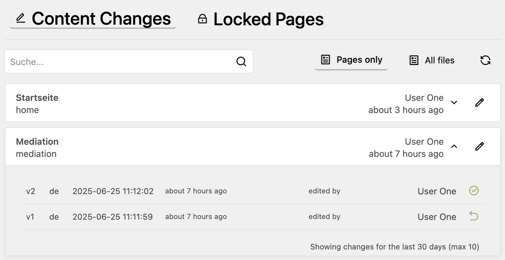

# Content Watch Plugin for Kirby

This plugin tracks all content changes in your Kirby site and adds a panel view that displays those changes.
It shows modification date and editor information and the history of changes for each file.
This allows you to keep track of what has been changed and who made the changes.

Additionally it provides a view to see which pages are currently locked and by whom.

[](https://github.com/tearoom1/kirby-content-watch)

***

## Features

- **Change Tracking**: Automatically tracks all content changes in pages and files
- **Editor Attribution**: Records which editor made each change with timestamp
- **History Timeline**: Lists all content files across your Kirby site, sorted by modification date
- **Locked Pages View**: Shows which pages are currently being edited and by whom
- **Search Functionality**: Quickly find specific content files
- **Direct Panel Links**: One-click access to edit content in the Panel
- **Customizable Retention**: Configure how long history is kept
- **Version Restore**: Restore previous versions of content with a single click (optional)
- **Dark Mode and Compact Layout**: Supports Kirby 5 dark mode and a compact layout option
- **Page Method**: Access change history programmatically via `$page->contentHistory()`

## Known Limitations

This plugin has been developed for rather smaller websites. It has not been tested on big sites or slow servers.
It stores all history entries in a single file for each content directory, and goes through them each time you open the plugins page.
This may be a problem for sites with a large number of files.

The restore feature also has some limitations
- binary files are not supported
- when restoring a page, its files are not restored

> Beware the restore feature is BETA and may have bugs. Use at your own risk!

## Installation

### Manual

1. Download or clone this repository
2. Place the folder `kirby-content-watch` in `/site/plugins/`

### Composer

```bash
composer require tearoom1/kirby-content-watch
```

## Usage

After installation, you'll see a new "Content Watch" item in the Panel menu. Click on it to access:

- **Files View**: All content files with their modification history
- **Locked Pages**: Overview of currently locked pages and who is editing them

Each file in the list can be expanded to show its modification history. For each history entry with a snapshot, a restore button is available to revert to that previous version.

## Configuration

You can configure the plugin in your `config.php`:

```php
return [
    'tearoom1.kirby-content-watch' => [
        'allowedRoles'     => [],
        'retentionDays'    => 30,
        'retentionCount'   => 10,
        'defaultPageSize'  => 10,
        'layoutStyle'      => 'default',
        'enableLockedPages' => true,
        'enableRestore'    => false,
        'enableDiff'       => false,
        'disable'          => false,
    ]
];
```

| Option | Type | Default | Description |
|--------|------|---------|-------------|
| `allowedRoles` | array | `[]` | Additional Kirby roles allowed to use the plugin. Admins always have access (see Access Control) |
| `retentionDays` | `int` | `30` | Number of days to keep history entries before they are pruned |
| `retentionCount` | `int` | `10` | Maximum number of history entries to keep per file |
| `defaultPageSize` | `int` | `10` | Default number of items per page in the panel view. Possible values: `10`, `20`, `50` |
| `layoutStyle` | `string` | `'default'` | Layout density of the list. Set to `'compact'` for a tighter layout |
| `enableLockedPages` | `bool` | `true` | Whether to show the locked pages view in the panel |
| `enableRestore` | `bool` | `false` | Enable content restore functionality. When enabled, full content snapshots are saved — increases disk usage |
| `enableDiff` | `bool` | `false` | Enable content diff view. Requires `enableRestore` to be `true` |
| `disable` | `bool` | `false` | Completely disable the plugin without uninstalling it |

### Access Control

By default, **only users with the `admin` role** can access the plugin — that includes the Content Watch panel area, the menu entry, the diff API, and the restore API. Non-admins will not see the menu item, and any direct API call returns `403 Forbidden`.

To grant access to additional Kirby roles, list them in `allowedRoles`:

```php
'tearoom1.kirby-content-watch' => [
    'allowedRoles' => ['editor'],
]
```

Notes:
- Admins are **always** allowed; you do not need to include `'admin'` in the list.
- The `allowedRoles` check gates *access to the plugin*. Restoring content additionally requires the user to have Kirby's update permission on the target page/file — so a role allowed by `allowedRoles` cannot use restore to overwrite content they are not normally allowed to edit.
- Only grant `allowedRoles` to roles you trust to read every page's modification history, including drafts.

## How It Works

The plugin creates a `.content-watch.json` file in each content directory that has been modified. This file stores the history of changes including editor information, timestamps, and content snapshots for restoration (if restore is enabled).
History entries are automatically pruned based on your retention settings.

When restore functionality is enabled:
1. Each time content is changed, a snapshot of the content is saved
2. You can view and restore previous versions through the interface
3. When you restore a previous version, the plugin will:
   - Extract the content from the saved snapshot
   - Overwrite the current content file
   - Record this restoration in the history with a reference to the restored version

When restore functionality is disabled:
1. The plugin only tracks metadata like timestamps and editor information
2. No content snapshots are stored, reducing disk usage
3. The restore buttons will not be displayed in the interface

> NOTE: The restore functionality only works for page content.
> It does not track changes of media/binary files.
> And when restoring a page, it does not restore its files.


### Page Method

The plugin exposes a `contentHistory()` method on all pages, giving you programmatic access to the change history from within templates or plugins.

```php
// Get all history entries for the current page
$history = $page->contentHistory();

// Filter by language (multilang setups)
$history = $page->contentHistory('en');
```

Each entry is an array with the following keys:

| Key | Description |
|-----|-------------|
| `version` | Incrementing version number |
| `time` | Unix timestamp of the change |
| `editor_id` | ID of the Kirby user who made the change |
| `type` | Always `page` for page content |
| `language` | Language code (multilang only, requires `enableRestore`) |
| `content` | Raw content snapshot (only present when `enableRestore` is `true`) |

**Example: display last editor info**

```php
$history = $page->contentHistory();
if (!empty($history)) {
    $latest = $history[0];
    $editor = kirby()->user($latest['editor_id']);
    echo 'Last edited ' . date('Y-m-d H:i', $latest['time']);
    echo ' by ' . ($editor ? $editor->name() : $latest['editor_id']);
}
```

**Example: access field values from a snapshot (requires `enableRestore: true`)**

```php
foreach ($page->contentHistory() as $entry) {
    $fields = isset($entry['content'])
        ? new \Kirby\Cms\Content(\Kirby\Data\Txt::decode($entry['content']), $page)
        : null;

    echo 'v' . $entry['version'] . ' — ' . date('Y-m-d H:i', $entry['time']);

    if ($fields) {
        echo ' — title: ' . $fields->title()->html();
    }
}
```

This gives you full Kirby field method access (`.html()`, `.kirbytext()`, `.value()`, etc.) on any historical snapshot.

### Diff Generation

If you like to have a more advanced diff, you can install `jfcherng/php-diff`
```bash
composer require jfcherng/php-diff
```

This will automatically make use of the advanced diff.


## Requirements

- Kirby 4 or 5
- PHP 8.1+

## Todo

- Add support for restoring media/binary files ?
- Language support is not perfect yet. Currently only 2 digit codes work and the display of the versions may also be improved.

## License

This plugin is licensed under the [MIT License](LICENSE)

## Credits

- Developed by Mathis Koblin
- Assisted by Claude (Anthropic)

[](https://coff.ee/tearoom1)
